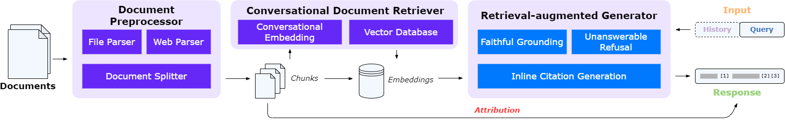

<h1 align="center">
  📚TruthReader
</h1>

<div align="center">

 [System Architecture](https://github.com/HITsz-TMG/TruthReader-document-assistant?tab=readme-ov-file#blue_book-system-architecture) | [Getting Started
](https://github.com/HITsz-TMG/TruthReader-document-assistant?tab=readme-ov-file#rocket-getting-started) | [Environments](https://github.com/HITsz-TMG/TruthReader-document-assistant?tab=readme-ov-file#zap-environments) | [Model and Data](https://github.com/HITsz-TMG/TruthReader-document-assistant?tab=readme-ov-file#card_index_dividers-model-and-data) | [Optimization Progress](https://github.com/HITsz-TMG/TruthReader-document-assistant?tab=readme-ov-file#thought_balloon-optimization-progress) | [Citation](https://github.com/HITsz-TMG/TruthReader-document-assistant?tab=readme-ov-file#link-citation)

</div>


TruthReader is a trustworthy document assistant chatbot that incorporates incline citation and attribution chunks, to facilitate the verification of the factual consistency in the generated text. We also provide our adapted conversational embedding retriever and LLMs to quickly develop this system.


## :blue_book: System Architecture

The architecture and workflow of our document assistant chatbot TruthReader. It consists of three components: *Document Preprocessor*, *Conversational Document Retriever*, and *Retrieval-augmented Generator*. The first module is only used for preliminary preprocessing, while the latter two together constitute the workflow of real-time conversation.


## :rocket: Getting Started


## :rainbow: Environments
```shell
conda env create -f environment.yaml
```


## :card_index_dividers: Model and Data
| Name                                                                  | Base Model  | Type |
| --------------------------------------------------------------------- | ----------- | ------------------------- |
| [HIT-TMG/bge-m3_RAG-conversational-IR](https://huggingface.co/HIT-TMG/bge-m3_RAG-conversational-IR)   | [BAAI/bge-m3](https://huggingface.co/BAAI/bge-m3)   | retriever                |
| [HIT-TMG/Mixtral_13B_Chat_RAG-Reader](https://huggingface.co/HIT-TMG/Mixtral_13B_Chat_RAG-Reader)               | [cloudyu/Mixtral_13B_Chat](https://huggingface.co/cloudyu/Mixtral_13B_Chat) | generator               |
| [HIT-TMG/Qwen1.5-14B-Chat_RAG-Reader](https://huggingface.co/HIT-TMG/Qwen1.5-14B-Chat_RAG-Reader) | [Qwen/Qwen1.5-14B-Chat](https://huggingface.co/Qwen/Qwen1.5-14B-Chat)  | generator              |

We also release our training dataset on the huggingface hub: [HIT-TMG/TruthReader_RAG_train](https://huggingface.co/datasets/HIT-TMG/TruthReader_RAG_train)


## :thought_balloon: Optimization Progress
To be released soon.


## :link: Citation
Please cite the repo if you use the model or code in this repo.

```
@misc{truthreader,
  author = {Dongfang Li and Xinshuo Hu and Zetian Sun and Baotian Hu and Shaolin Ye and Zifei Shan and Qian Chen and Min Zhang},
  title = {TruthReader: Towards Trustworthy Document Assistant Chatbot with Reliable Attribution},
  year = {2024},
  publisher = {GitHub},
  journal = {GitHub repository},
  howpublished = {\url{https://github.com/HITsz-TMG/TruthReader-document-assistant}},
}
```


## :scroll: License

This repository respects to MIT license.